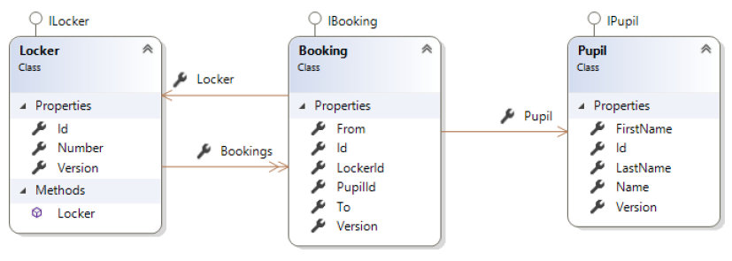
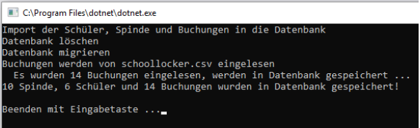
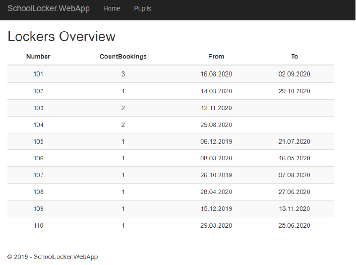
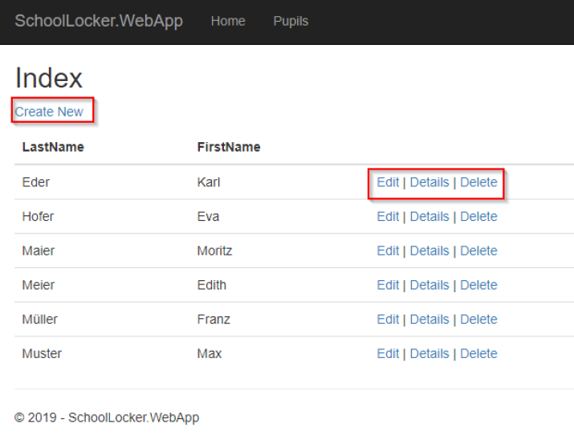
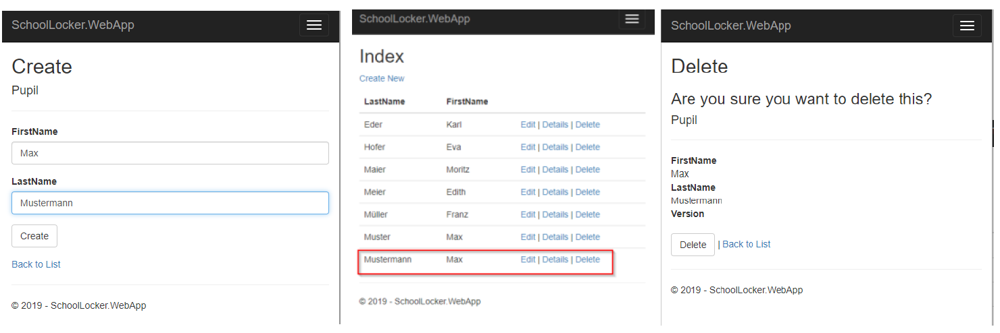
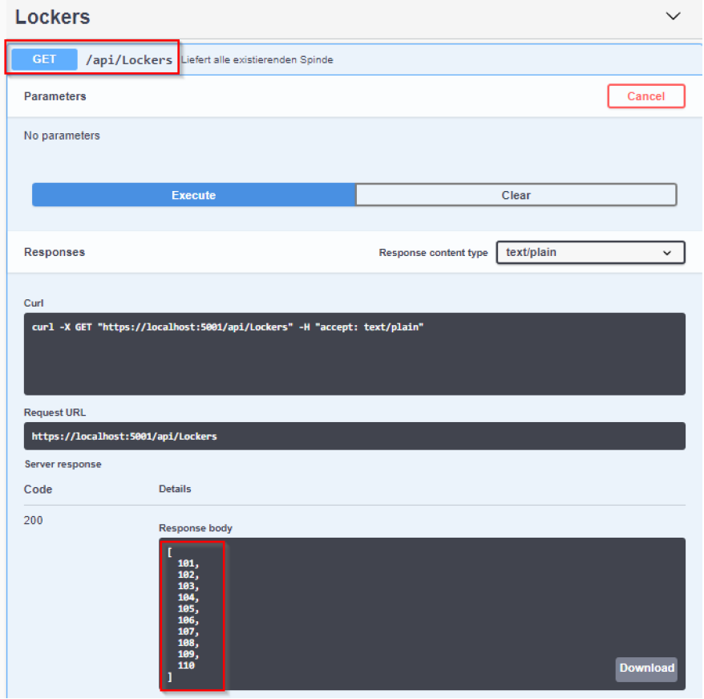
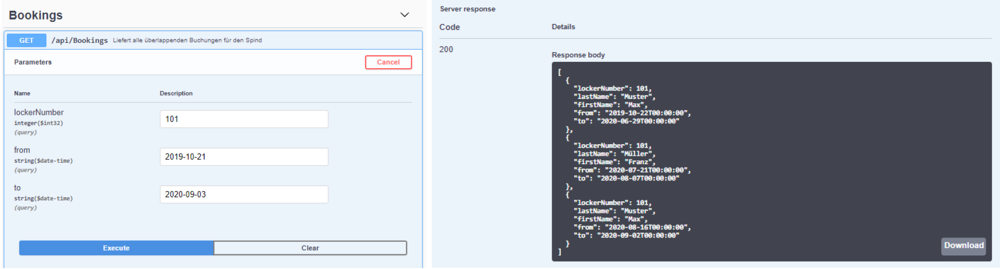
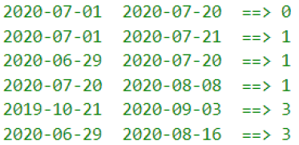

# SchoolLocker (Teil 1)

## Lernziele

* ASP.NET Core Razor Pages
* ASP.NET Core WebApi
* Entity Framework Core
* Muster: UnitOfWork, Repositories
* Validierung

Es ist eine einfache Verwaltung von Buchungen für die Spinde in der Schule zu erstellen. Im Zentrum der Anwendung steht die Buchung (`Booking`) eines Spindes (`Locker`) durch einen Schüler (`Pupil`).

Ein Schüler kann mehrere Spinde anmieten. Ein Spind kann mehrfach, aber natürlich nicht gleichzeitig gebucht werden. Es ist möglich, bei der Buchung das Ende-Datum offen zu lassen.

## Core

Die Entitätsklassen sind bereits angelegt. Auch die Annotationen zur Definition (inkl. der Migrationen) der Datenbank sind bereits implementiert.

## Klassendiagramm

Im Core-Layer sind die Contracts für die Repositories bedarfsgerecht zu erweitern. Die leeren Interfaces sind bereits vorgegeben.

## Import / Persistierung

Es werden die 10 Spinde mit 14 Buchungen für 6 Schüler aus der Datei schoollocker.csv importiert.

Die Migration wurde bereits angelegt und muss nur verwendet werden, wenn an den Entitätsklassen Änderungen vorgenommen werden:

* Persistence als StartupProject
* `Add-Migration InitialMigration`
* `UpdateDatabase` mit Kontrolle, ob DB angelegt wurde
* Die Daten über die `ImportConsole` importieren.

Die `ConnectionStrings` wurden in den relevanten Projekten schon in der appSettings.json festgelegt.

## ASP.NET Core Razor Pages (SchoolLocker.WebApp)

Erstellen Sie ein geeignetes ASP.NET Core Projekt (inkl. Abhängigkeiten) mit der Bezeichnung `SchoolLocker.WebApp`.

Verwenden Sie Dependency Injection um die `UnitOfWork` in den PageModels verwenden zu können!

Implementieren Sie zumindest folgende zwei Razor Pages:

### Page "Index"

**Anforderungen**

1. Stellen Sie alle Spinde in einer Tabelle übersichtlich dar.
2. Spalten der Tabelle
   * LockerNumber
   * Anzahl der Buchungen für Locker
   * Letzte Buchung: From
   * Letzte Buchung: To (oder leer)
3. Sortierung der Tabelle
   * LockerNumber

### Page "Pupils"

**Anforderungen**

Über die Route `Pupils` (oder Link auf Startseite) erreicht man die Übersicht der registrierten Schüler.

Ein neuer Schüler kann angelegt werden (`Create New`). Die Daten eines Schülers können geändert werden (`Edit`). `Details` verweist auf eine Detailseite und mit `Delete` kann ein Schüler (nach Rückfrage) gelöscht werden.

## ASP.NET WebApi (SchoolLocker.WebApi)

Erstellen Sie ein geeignetes ASP.NET Core Projekt (inkl. Abhängigkeiten) mit der Bezeichnung `SchoolLocker.WebApi`.

Implementieren Sie zwei `Controller` die per Swagger zu testen sind.

### Route `/api/lockers`

* Die Spinde sind sortiert nach der Spindnummer auszugeben
* Der Rückgabetyp ist ein Integer-Array

### Route `/api/bookings`

* Liefert für den Spind mit der übergebenen `lockerNumber` alle Buchungen, die den gesuchten Zeitraum (ebenfalls als Parameter übergeben) überlappen
* Die Buchungen sind sortiert nach dem From-Datum auszugeben
* Der Rückgabetyp ist ein entsprechendes `Dto`

Testen Sie die folgenden Zeiträume für den Locker 101:

## Hinweise
* Verwenden Sie Validierungsattribute um die Datenkonsistenz sicherzustellen
   * Z.B. Buchung: von-Datum darf nicht nach dem bis-Datum liegen!
* Verwenden Sie dort wo sinnvoll DataTransferObjects
* Achten Sie auf eine korrekte Schichtentrennung (Core, Persistence und Web)
* Verwenden Sie das UnitOfWork-Muster
* Dependency Injection (IoC) verwenden
* Erweitern Sie, wo notwendig die Repositories
